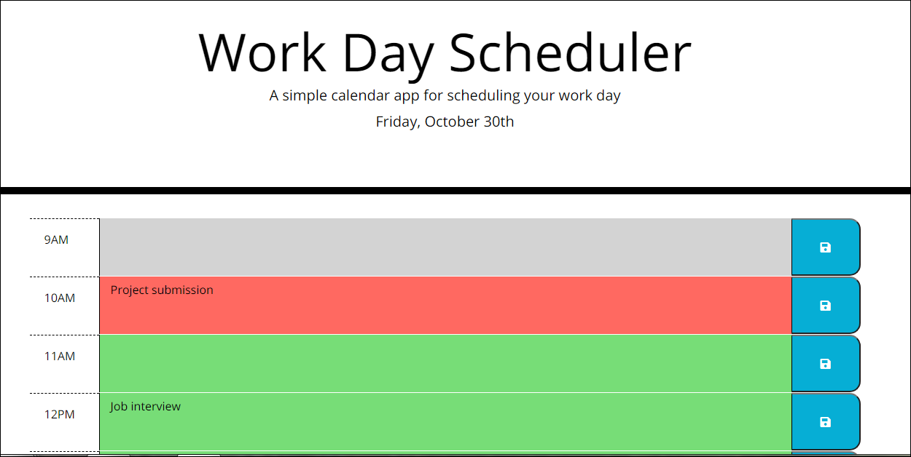
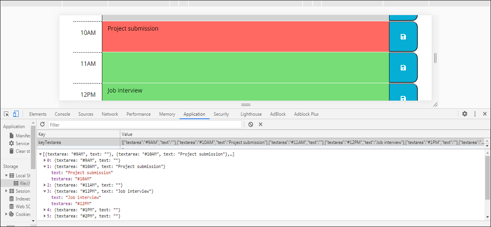

# Day Planner Application

## Description 

The client has requested a simple calendar planner application, that allows to save events for each hour, for better time managment. The program should easy to use, also each time block needs to be colored in different colors for past, present and future tasks. Saved events have to stay inside the blocks, after being saved, even if browser window will be closed and reloaded.

## Table of Contents

* [Installation](#installation)
* [Usage](#usage)
* [Links](#links)
* [Credits](#credits)

## Installation

To complete this task, various libraries need to be installed, such as jQuery, Moment.js and Bootstrap to ensure the best functionality and appropriate styles. Also we added links to fonts from [google.com](https://fonts.googleapis.com/) and [fontawesome.com](https://fontawesome.com/). Google Chrome Dev Tools were used to test the applications and to make sure that everything is working properly. Software ScreenCastify was installed to capture the screenshots of the application to present it and explain the usage. The file structure contains index, style and script files, written in HTML, CSS and JavaScript languages. Quality comments added for better understanding the code, in case it needs to be modified in the future.

## Usage

After the application has been launched, the user will be presented with a page, containing current day and a month, and the times blocks below for each business hour (9am-6pm) and fleids to be filled up with various tasks. Each filled has a background color that represents certain timeframes - gray for block that are in the past, pink for the current hour and green for the time blocks in the future. 
The client can click on any container to add a task, then on a blue button to save the event to the local storage, where it would stay even if the the page will be reloaded or brower window will be closed, until the client will decide to delete it or to modify it. 
To get the current time, we used a script template from the Moment.js library. To ensure the best functionality and easy execution the jQuery library was implemented in the code structure. The application is launched at live URL, it's very intuitive, runs with no errors and resembles the provided mock-up functionality. The repository has an easy to navigate structure. Every file containes discriptive comments and follows the best practices of naming conventions.   

Attached below the screenshots of the 100% functional applicaton: 

 

 

## Links

[Day Planner App](https://anaiva27.github.io/Day-Planner-App/)  
[GitHub repository](https://github.com/anaiva27/Day-Planner-App) 
Libraries: 
[jQuery](https://cdnjs.cloudflare.com/ajax/libs/jquery/3.2.1/jquery.min.js)  
[Moment.js](https://cdnjs.cloudflare.com/ajax/libs/moment.js/2.24.0/moment.min.js)  

## Credits

Useful articles about Javascript functions, statements and loops, local storage: 
[jQuery API](https://api.jquery.com/)  
[Moment.js tutorial](https://www.sitepoint.com/managing-dates-times-using-moment-js/)  
[JavaScript objects](https://www.w3schools.com/js/js_objects.asp) 
[Local Storage](https://developer.mozilla.org/en-US/docs/Web/API/Window/localStorage) 
[CSS selectors](https://www.w3schools.com/css/css_selectors.asp)

